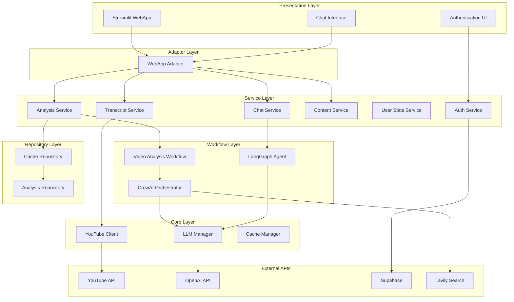

# Skimr - AI-Powered YouTube Video Analyzer

<div align="center">

[](https://github.com/yourusername/skimr)
[](https://python.org)
[](https://streamlit.io)
[](LICENSE)

*Transform hours of video content into actionable insights in minutes*

[🚀 Quick Start](#quick-start) • [📖 Documentation](#documentation) • [🏗️ Architecture](#architecture) • [🤝 Contributing](#contributing)

</div>

## 🎯 Overview

Skimr is an enterprise-grade YouTube video analysis platform that leverages cutting-edge AI to transform video content consumption. Built with a robust service-oriented architecture, it provides intelligent video analysis, interactive chat capabilities, and automated content generation tools.

### 🎬 Problem Statement

In today's content-rich environment, professionals and researchers face significant challenges:

- **Time Inefficiency**: Watching hours of video content to extract key insights
- **Information Discovery**: Determining video relevance without full consumption  
- **Context Navigation**: Finding specific information within lengthy videos
- **Knowledge Extraction**: Converting educational content into actionable insights
- **Content Repurposing**: Adapting video content for different platforms and formats

### ✨ Solution

Skimr addresses these challenges through an intelligent AI-driven approach:

- **🤖 AI-Powered Analysis**: Multi-agent CrewAI system for comprehensive content understanding
- **💬 Interactive Q&A**: LangGraph-powered chat interface for video exploration
- **📊 Smart Categorization**: Automated classification with context-aware tagging
- **⚡ Real-time Insights**: Streaming analysis with live progress tracking
- **🎨 Content Generation**: Automated blog posts, social media content, and summaries
- **🔍 Semantic Search**: Vector-based transcript exploration with timestamp navigation
- **🏗️ Enterprise Architecture**: Scalable, maintainable design with comprehensive caching

## 🌟 Key Features

### Core Analysis Engine
- **Multi-Modal Transcript Processing** with automated extraction and timestamping
- **Advanced Whisper Transcription** with multiple model options (whisper-1, gpt-4o-transcribe, gpt-4o-mini-transcribe)
- **Intelligent Content Categorization** using specialized AI agents
- **Context-Aware Classification** (Tutorial, Review, Interview, Educational, etc.)
- **Comprehensive Video Summarization** with key point extraction
- **Actionable Insights Generation** with recommended next steps
- **Custom Instructions Support** for tailoring content generation outputs

### Interactive Intelligence
- **Real-time Chat Interface** powered by LangGraph and RAG (Retrieval-Augmented Generation)
- **Vector-Based Semantic Search** through video transcripts using FAISS
- **Timestamp-Synchronized Navigation** with clickable transcript segments
- **Streaming AI Responses** for enhanced user experience

### Content Generation Suite
- **Professional Blog Post Creation** with web research integration
- **LinkedIn Content Optimization** for professional networking
- **Twitter Thread Generation** with influencer-style adaptation
- **SEO-Optimized Summaries** for content marketing
- **Customizable Output Formatting** through dynamic instructions

### Enterprise Features
- **Multi-Tenant Authentication** with Supabase integration
- **Advanced Caching System** with TTL and memory management
- **Performance Analytics** with detailed metrics and monitoring
- **Docker-Ready Deployment** with multi-stage builds
- **Comprehensive API Integration** (OpenAI, Anthropic, Google Gemini)

## 🚀 Quick Start

### Prerequisites

- **Python 3.8+** with pip package manager
- **API Keys** for at least one LLM provider:
  - OpenAI API key (recommended for optimal performance)
  - Anthropic API key (optional, for Claude models)  
  - Google API key (optional, for Gemini models)
- **Tavily API key** (optional, for enhanced web search capabilities)
- **Supabase credentials** (optional, for user authentication)
- **FFmpeg** (required for audio processing with Whisper transcription)

### 🔧 Installation

1. **Clone the repository**
   ```bash
   git clone https://github.com/yourusername/skimr.git
   cd skimr
   ```

2. **Set up Python environment**
   ```bash
   # Create virtual environment
   python -m venv venv
   
   # Activate virtual environment
   # On Windows:
   venv\Scripts\activate
   # On macOS/Linux:
   source venv/bin/activate
   ```

3. **Install dependencies**
   ```bash
   pip install -r requirements.txt
   ```

4. **Configure environment variables**
   ```bash
   # Copy example environment file
   cp .env.example .env
   
   # Edit .env with your API keys
   nano .env
   ```

   **Required Environment Variables:**
   ```env
   # Core LLM API (choose at least one)
   OPENAI_API_KEY=your_openai_api_key_here
   GEMINI_API_KEY=your_gemini_api_key_here
   
   # Optional: Enhanced search capabilities
   TAVILY_API_KEY=your_tavily_api_key_here
   
   # Optional: User authentication
   SUPABASE_URL=your_supabase_project_url
   SUPABASE_KEY=your_supabase_anon_key
   
   # Application Configuration
   CACHE_EXPIRY_DAYS=7
   LOG_LEVEL=INFO
   MAX_GUEST_ANALYSES=1
   ```

5. **Launch the application**
   ```bash
   streamlit run src/youtube_analysis_webapp.py
   ```

6. **Access the interface**
   - Open your browser to `http://localhost:8501`
   - Enter a YouTube URL and start analyzing!

### 🐳 Docker Deployment

```bash
# Build the Docker image
docker build -t skimr .

# Run the container
docker run -p 8501:8501 --env-file .env skimr
```

## 📖 Documentation

### 🎯 Basic Usage

1. **Video Analysis**
   - Enter any YouTube URL in the input field
   - Click "Analyze Video" to start processing
   - Monitor real-time progress through the status indicators
   - Explore results across organized tabs (Summary, Analysis, Transcript, etc.)

2. **Interactive Chat**
   - Use the chat interface to ask specific questions about the video
   - Leverage semantic search to find relevant content segments
   - Click on timestamp references to navigate directly to video moments

3. **Content Generation**
   - Generate blog posts, LinkedIn content, or tweets on-demand
   - Utilize web search integration for current information enhancement
   - Customize content style and tone through the settings
   - Apply custom instructions to tailor the output format and style

4. **Settings Configuration**
   - Select preferred AI model (GPT-4, Gemini, Claude)
   - Adjust creativity level with temperature controls
   - Enable/disable caching for performance optimization
   - Toggle Phase 2 architecture features

### 🔧 Advanced Configuration

#### Transcription Options
```python
# Supported Whisper models:
transcription_models = {
    "whisper-1": "Original Whisper model with detailed segmentation",
    "gpt-4o-transcribe": "High-quality transcription with GPT-4o",
    "gpt-4o-mini-transcribe": "Faster, cost-effective transcription"
}
```

#### Custom Instructions
The system supports custom instructions for content generation tasks:
```yaml
# Example custom instruction for blog post:
"Focus on the technical aspects of the video and include code examples where relevant.
Add a section discussing alternative approaches and compare them."

# Example custom instruction for LinkedIn post:
"Target this post toward software engineering managers highlighting team productivity benefits."
```

#### Model Selection
```python
# Supported models with recommended use cases:
models = {
    "gpt-4o-mini": "Fast, cost-effective for most analyses",
    "gemini-2.0-flash": "Balanced performance and quality", 
    "gemini-2.0-flash-lite": "Ultra-fast responses",
    "claude-3-haiku": "Creative content generation"
}
```

#### Cache Management
- **Automatic TTL**: Configurable expiry (default: 7 days)
- **Memory Limits**: Intelligent cleanup of old entries
- **Selective Clearing**: Per-video cache management
- **Background Refresh**: Proactive cache updates for popular content

#### Performance Tuning
```env
# Optimize for your deployment environment
CACHE_EXPIRY_DAYS=7          # Adjust based on storage capacity
MAX_GUEST_ANALYSES=1         # Control guest user limits
USE_OPTIMIZED_ANALYSIS=true  # Enable Phase 2 architecture
CONNECTION_POOL_SIZE=10      # YouTube API connection pooling
```

## 🏗️ Architecture

Skimr implements a sophisticated **Phase 2 Service-Oriented Architecture** designed for scalability, maintainability, and performance.

### 🧩 System Design Overview



### 📁 Project Structure

```
skimr/
├── 📁 src/                          # Source code root
│   └── 📁 youtube_analysis/         # Main application package
│       ├── 📁 adapters/             # Interface adapters (Hexagonal Architecture)
│       │   └── webapp_adapter.py    # WebApp interface adapter
│       ├── 📁 core/                 # Core business entities and utilities
│       │   ├── config.py            # Application configuration
│       │   ├── cache_manager.py     # Smart caching implementation
│       │   ├── youtube_client.py    # YouTube API client with pooling
│       │   └── llm_manager.py       # Multi-provider LLM management
│       ├── 📁 services/             # Business logic layer (Domain Services)
│       │   ├── analysis_service.py  # Video analysis orchestration
│       │   ├── chat_service.py      # Interactive chat management
│       │   ├── content_service.py   # Content generation services
│       │   ├── transcript_service.py # Transcript processing
│       │   ├── auth_service.py      # Authentication services
│       │   └── user_stats_service.py # User analytics
│       ├── 📁 transcription/        # Transcription subsystem
│       │   ├── factory.py           # Transcription factory pattern
│       │   ├── base.py              # Base transcriber interface
│       │   ├── whisper.py           # OpenAI Whisper implementation
│       │   └── models.py            # Transcription data models
│       ├── 📁 workflows/            # Business process orchestration
│       │   ├── video_analysis_workflow.py # Main analysis pipeline
│       │   └── crew.py             # CrewAI agent orchestration
│       ├── 📁 repositories/         # Data access layer
│       │   └── cache_repository.py  # Cache data persistence
│       ├── 📁 models/              # Domain models and DTOs
│       ├── 📁 ui/                  # User interface components
│       │   ├── components.py       # Streamlit UI components
│       │   ├── helpers.py          # UI utility functions
│       │   └── session_manager.py  # Session state management
│       ├── 📁 utils/               # Shared utilities
│       │   ├── youtube_utils.py    # YouTube-specific utilities
│       │   ├── logging.py          # Centralized logging
│       │   └── cache_utils.py      # Cache utilities
│       ├── 📁 tools/               # Custom AI tools
│       │   └── youtube_tools.py    # CrewAI custom tools
│       └── 📁 config/              # Configuration files
│           ├── agents.yaml         # CrewAI agent definitions
│           └── tasks.yaml          # CrewAI task configurations
├── 📁 analysis_cache/              # Persistent analysis cache
├── 📁 transcript_cache/            # Transcript storage cache
├── 📄 youtube_analysis_webapp.py   # Main Streamlit application
├── 📄 youtube_rag_langgraph.py     # Simplified RAG-only version
├── 📄 requirements.txt             # Python dependencies
├── 📄 Dockerfile                   # Container configuration
└── 📄 .env                         # Environment configuration
```

### 🎨 Design Patterns

#### 1. **Hexagonal Architecture (Ports and Adapters)**
- **Core Domain**: Pure business logic without external dependencies
- **Adapters**: Interface implementations for external systems
- **Ports**: Abstract interfaces defining contracts

#### 2. **Service Layer Pattern**
- **Single Responsibility**: Each service handles specific business domain
- **Dependency Injection**: Services receive dependencies through constructors
- **Interface Segregation**: Clear boundaries between service responsibilities

#### 3. **Repository Pattern**
- **Data Abstraction**: Abstract data access behind repository interfaces
- **Caching Strategy**: Intelligent caching with TTL and memory management
- **Multiple Backends**: Support for different storage mechanisms

#### 4. **Factory Pattern**
- **Service Creation**: Centralized service instantiation
- **Transcription Management**: Flexible transcription provider selection
- **Configuration Management**: Dynamic service configuration
- **Dependency Resolution**: Automatic dependency injection

### 🔄 Data Flow Architecture

1. **Request Processing**
   ```
   UI Component → WebApp Adapter → Service Layer → Workflow → Core Services → External APIs
   ```

2. **Caching Strategy**
   ```
   Request → Cache Check → Service Logic → Data Persistence → Response
   ```

3. **Error Handling**
   ```
   Exception → Service Handler → Adapter Translation → UI Display
   ```

### ⚡ Performance Optimizations

#### 1. **Smart Caching System**
- **Multi-Level Caching**: Memory + Persistent storage
- **TTL Management**: Configurable time-to-live
- **Background Refresh**: Proactive cache updates
- **Memory Limits**: Automatic cleanup of old entries

#### 2. **Connection Pooling**
- **HTTP Session Reuse**: Persistent connections to YouTube API
- **Concurrent Requests**: Parallel processing capabilities
- **Rate Limiting**: Intelligent request throttling

#### 3. **Asynchronous Processing**
- **Streaming Responses**: Real-time UI updates
- **Background Tasks**: Non-blocking operations
- **Concurrent Analysis**: Parallel agent execution

## 🛠️ Technology Stack

### 🧠 AI & Machine Learning
- **CrewAI** (0.121.1): Multi-agent orchestration framework
- **LangGraph** (0.4.7): Stateful agent workflow management
- **LangChain** (0.3.25): LLM application development framework
- **OpenAI GPT Models**: Primary language models
- **OpenAI Whisper**: Advanced audio transcription
- **Anthropic Claude**: Alternative LLM provider
- **Google Gemini**: Additional LLM options
- **FAISS** (1.10.0): Vector similarity search

### 🖥️ Backend & Infrastructure
- **FastAPI** (0.115.12): High-performance async API framework
- **Streamlit** (1.44.1): Interactive web application framework
- **Supabase** (2.15.2): Backend-as-a-Service with authentication
- **Pydantic** (2.11.5): Data validation and settings management
- **FFmpeg**: Audio processing for transcription

### 🔧 Data Processing
- **youtube-transcript-api** (1.0.3): Transcript extraction
- **yt-dlp** (2025.5.22): Advanced YouTube data extraction
- **pandas** (2.2.3): Data manipulation and analysis
- **numpy** (2.2.6): Numerical computing

### 📊 Search & Analytics
- **Tavily Search**: Web search integration
- **FAISS Vector Store**: Semantic search capabilities
- **Custom Analytics**: User behavior tracking

### 🐳 Deployment & DevOps
- **Docker**: Containerized deployment
- **Multi-stage Builds**: Optimized container images
- **Environment Configuration**: Flexible deployment settings

## 🔧 Configuration Guide

### 📋 Environment Variables Reference

```env
# === Core API Keys ===
OPENAI_API_KEY=sk-...                    # Required for OpenAI models
GEMINI_API_KEY=AI...                     # Required for Google models
ANTHROPIC_API_KEY=sk-ant-...             # Required for Claude models
TAVILY_API_KEY=tvly-...                  # Optional: Enhanced search

# === Authentication (Optional) ===
SUPABASE_URL=https://your-project.supabase.co
SUPABASE_KEY=eyJ...                      # Supabase anonymous key

# === Application Settings ===
APP_VERSION=2.0.0                        # Application version
CACHE_EXPIRY_DAYS=7                      # Cache TTL in days
MAX_GUEST_ANALYSES=1                     # Free tier limit
LOG_LEVEL=INFO                           # Logging verbosity

# === Performance Tuning ===
USE_OPTIMIZED_ANALYSIS=true              # Enable Phase 2 features
CONNECTION_POOL_SIZE=10                  # API connection pooling
ENABLE_BACKGROUND_REFRESH=true           # Proactive cache updates

# === Feature Flags ===
ENABLE_AUTH=true                         # User authentication
ENABLE_YOUTUBE_API=true                  # YouTube API integration
ENABLE_WEB_SEARCH=true                   # Tavily search integration

# === Transcription Settings ===
DEFAULT_WHISPER_MODEL=gpt-4o-transcribe  # Default transcription model
```

### 🎛️ Model Configuration

```python
# Model performance characteristics
MODEL_CONFIGS = {
    "gpt-4.1-mini": {
        "cost": "low",
        "speed": "fast", 
        "quality": "medium",
        "use_case": "General analysis and chat"
    },
    "gemini-2.5-flash": {
        "cost": "low",
        "speed": "very_fast",
        "quality": "medium", 
        "use_case": "General analysis and chat"
    },
    "gemini-2.5-pro": {
        "cost": "high",
        "speed": "slow",
        "quality": "high",
        "use_case": "Content generation and analysis"
    }
}
```

## 📊 API Reference

### 🔌 Core Service Interfaces

#### VideoAnalysisService
```python
class VideoAnalysisService:
    async def analyze_video(
        self, 
        youtube_url: str, 
        settings: AnalysisSettings
    ) -> AnalysisResult:
        """Perform comprehensive video analysis"""
        
    async def get_analysis_status(
        self, 
        video_id: str
    ) -> AnalysisStatus:
        """Get real-time analysis progress"""
```

#### ChatService  
```python
class ChatService:
    async def initialize_chat(
        self, 
        video_id: str, 
        transcript: Transcript
    ) -> None:
        """Initialize chat for a specific video"""
        
    async def get_response(
        self, 
        user_input: str,
        chat_history: List[Dict]
    ) -> AsyncGenerator[str, None]:
        """Get streaming response to user query"""
```

#### TranscriptService
```python
class TranscriptService:
    async def get_transcript(
        self, 
        video_id: str,
        language: str = "en",
        use_cache: bool = True,
        transcription_model: str = None
    ) -> Transcript:
        """Get video transcript with specified options"""
```

#### ContentService
```python
class ContentService:
    async def generate_content(
        self, 
        video_id: str,
        content_type: str,
        custom_instructions: str = None
    ) -> str:
        """Generate content based on video analysis"""
```

## 🤝 Contributing

Contributions are welcome! Here's how you can help:

1. **Fork the repository**
2. **Create a feature branch**
   ```bash
   git checkout -b feature/amazing-feature
   ```
3. **Commit your changes**
   ```bash
   git commit -m 'Add some amazing feature'
   ```
4. **Push to the branch**
   ```bash
   git push origin feature/amazing-feature
   ```
5. **Open a Pull Request**

Please make sure to update tests as appropriate and adhere to the existing coding style.

## 📜 License

This project is licensed under the MIT License - see the LICENSE file for details.

## 📫 Contact

For questions, feedback, or support, please open an issue on GitHub or contact the maintainers directly.

---

<div align="center">
<p>Made with ❤️ by the Skimr Team</p>
</div>

